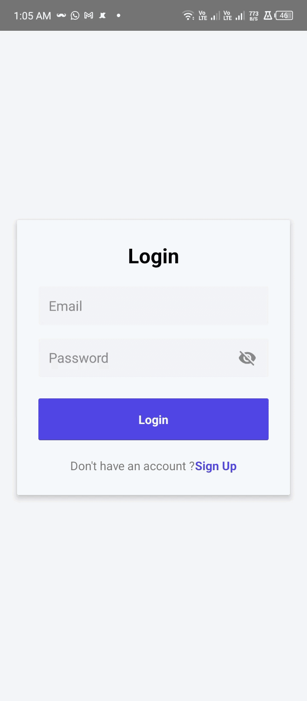
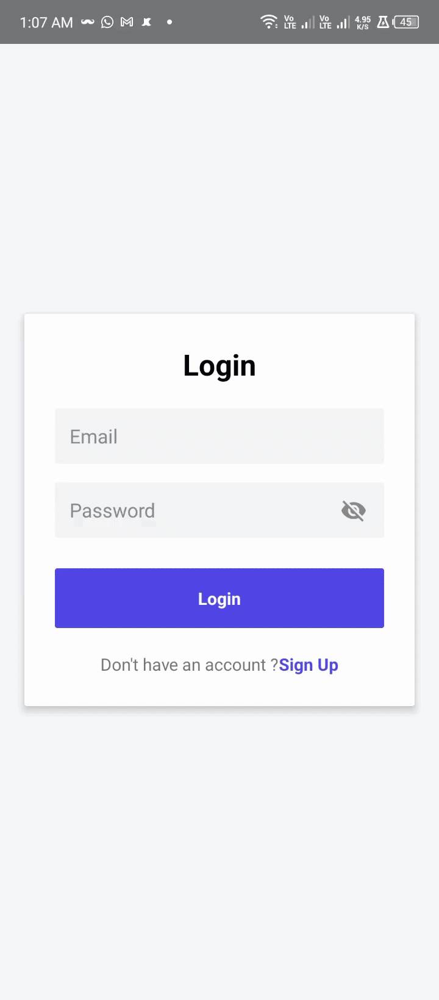
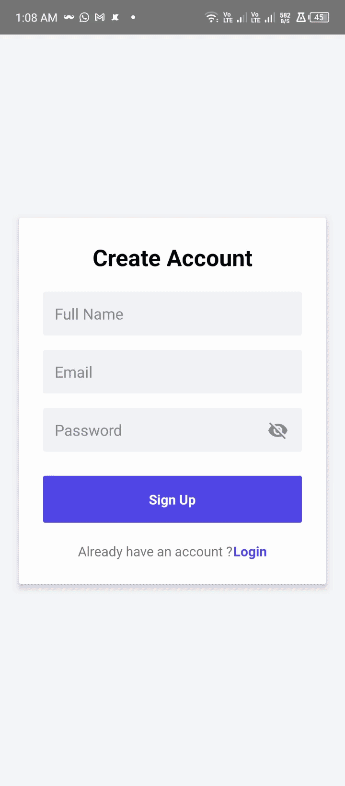

# **Authify**

Authify is a simple and secure authentication app built with React Native, featuring seamless login and signup functionality.

---

## **Technical Overview**

### **Component Based Architecture**

Authify is built using a **component-based architecture**, where the UI is decomposed into smaller, reusable components to improve scalability and maintainability.

### 🔹 Key Architectural Decisions

- ♻️ **Reusable UI Components** – Input fields, buttons, and form elements are separated into independent components for better reusability.  
- 🧩 **Separation of Concerns** – Screens focus on layout and logic, while components handle presentation.  
- 📂 **Organized Folder Structure** – Clear separation between `components`, `screens`, and `navigation`.  
- 📈 **Scalability First Approach** – The structure makes it easy to extend with additional features.

This approach ensures cleaner code, easier debugging, and improved long-term maintainability.

## State Management

Authify uses the **React Context API** combined with custom reducers to manage global state across the app. This modular approach keeps state predictable, avoids prop drilling, and makes the app scalable for future authentication features.

- **context**: Provides shared authentication state (e.g., user session, login status) via React Context Providers.  
- **reducer**: Defines pure functions to handle state updates based on dispatched authentication actions (login, logout, signup).


## Form Validation

Authify uses **React Hook Form** for efficient and scalable form handling and validation.

- ⚡ **Performance Optimized** – Minimizes re-renders for better performance.  
- 🧾 **Declarative Validation Rules** – Easily define required fields, email patterns, password rules, etc.  
- 🚨 **Error Handling** – Displays user-friendly validation messages for invalid inputs.  
- 🔄 **Controlled & Uncontrolled Inputs Support** – Flexible integration with custom input components.

This ensures a smooth user experience with real-time validation and clean form management.

## Persistent Authentication

Authify implements **persistent authentication** using AsyncStorage to maintain user sessions across app restarts.

- 🔐 **AsyncStorage Integration** – Stores authentication tokens or user session data locally.  
- 🔄 **Session Restoration** – Restores authentication state when the app relaunches.  
- 🚀 **Seamless User Experience** – Keeps users logged in even after closing the app.

This ensures a smooth and uninterrupted authentication flow.

## Navigation

Authify uses **React Navigation** to handle seamless navigation between authentication screens.

- 🔀 **Stack Navigation** – Manages transitions between Login and Signup screens.  
- 🧠 **Authentication Flow Control** – Conditionally renders screens based on authentication state.  
- 🎯 **Smooth Screen Transitions** – Provides a native-like navigation experience.  
- 📱 **Scalable Structure** – Easily extendable for adding protected routes or additional screens.

This ensures a clean and organized routing structure while maintaining a smooth user experience.

## Project Structure

Authify follows a **clean, modular, and scalable architecture** to ensure maintainability and reusability. The folder structure is organized by responsibility, making it easy to extend and manage as the application grows.

```
├── components # Reusable UI components (component-based architecture)
├── constants # Application-wide constants and configuration
├── hooks # Custom React hooks for shared logic
├── navigation # Navigation setup and authentication flow routing
├── screens # App screens (e.g., Login, Signup, Home)
├── store # Global state management (Context API + reducers)
├── styles # Centralized styling for components
└── types # TypeScript types and interfaces

```


## Code Quality & Consistency

Authify maintains a clean, reliable, and consistent codebase using a combination of development tools:

- **ESLint**: Performs static code analysis to enforce coding standards and catch potential errors.  
- **Prettier**: Automatically formats code for a consistent style across the project.  
- **TypeScript (tsc)**: Provides type safety by checking types during development.  
- **Test Runner (e.g., Jest)**: Executes unit and integration tests to ensure functionality works as intended.  

These tools help ensure that all commits adhere to the project’s coding standards and maintain high-quality, maintainable code.


## Demo

Here’s a quick overview of Authify’s main features in action.
---

### 1️⃣ Form Validation

Authify uses **React Hook Form** to handle all form inputs with proper validation.  
The app handles the following scenarios:

- ❌ **Invalid Email/Password Format** – Shows error messages when the email or password does not meet the required format.  
- ❌ **Missing Fields** – Prompts the user if any mandatory field (email, password, name) is left empty.  
- ❌ **Password Length** – Enforces a minimum password length of 6 characters and shows validation errors if violated.  
- 👁️ **Password Visibility Toggle** – Includes an eye icon in password fields to allow users to hide or show their password for better usability.



---

### 2️⃣ Login Validation

The login flow is protected with proper validation and state management:

- ❌ **Incorrect Credentials** – Displays an error message if the entered email or password is invalid.  
- ✅ **Happy Flow** – On successful login, the user is redirected to the Home screen where their **name** and **email** are displayed.  




---

### 3️⃣ Signup Validation

The signup flow ensures smooth user registration with validation:

- ❌ **Existing Email** – Shows an error message if a user tries to register with an email that already exists in the system.  
- ✅ **Happy Flow** – Successfully registers a new user and logs them in automatically or redirects them to the login screen.  



---

### 4️⃣ Persistent Authentication

Authify ensures users remain logged in across sessions using **AsyncStorage**:

- 🔄 **Session Persistence** – The user’s login state and session data are stored locally.  
- ✅ **Seamless Experience** – After closing and reopening the app, the user remains logged in and is redirected to the Home screen automatically.  


---

This demo section highlights the key authentication flows, form validation, and session management that make Authify a smooth and user-friendly React Native app.